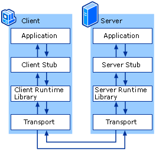

# Go RPC 开发指南

本书首先介绍了使用Go官方库开发RPC服务的方法，然后介绍流行gRPC库以及其它一些RPC框架如Thrift等，后面重点介绍高性能的分布式全功能的RPC框架 rpcx。读者通过阅读本书，可以快速学习和了解Go生态圈的RPC开发技术，并且应用到产品的开发中。

## RPC介绍
远程过程调用（Remote Procedure Call，缩写为 RPC）是一个计算机通信协议。
该协议允许运行于一台计算机的程序调用另一台计算机的子程序，而程序员无需额外地为这个交互作用编程。
如果涉及的软件采用面向对象编程，那么远程过程调用亦可称作远程调用或远程方法调用，比如 Java RMI。

有关RPC的想法至少可以追溯到1976年以“信使报”（Courier）的名义使用。RPC首次在UNIX平台上普及的执行工具程序是SUN公司的RPC（现在叫ONC RPC）。它被用作SUN的NFC的主要部件。ONC RPC今天仍在服务器上被广泛使用。 
另一个早期UNIX平台的工具是“阿波罗”计算机网络计算系统（NCS），它很快就用做OSF的分布计算环境（DCE）中的DCE/RPC的基础，并补充了DCOM。

远程过程调用是一个分布式计算的客户端-服务器（Client/Server）的例子，它简单而又广受欢迎。
远程过程调用总是由客户端对服务器发出一个执行若干过程请求，并用客户端提供的参数。执行结果将返回给客户端。
由于存在各式各样的变体和细节差异，对应地派生了各式远程过程调用协议，而且它们并不互相兼容。

为了允许不同的客户端均能访问服务器，许多标准化的 RPC 系统应运而生了。其中大部分采用接口描述语言（Interface Description Language，IDL），方便跨平台的远程过程调用。

从上图可以看出, RPC 本身是 client-server模型,也是一种 request-response 协议。

有些实现扩展了远程调用的模型，实现了双向的服务调用，但是不管怎样，调用过程还是由一个客户端发起，服务器端提供响应，基本模型没有变化。

服务的调用过程为：

1. client调用client stub，这是一次本地过程调用
2. client stub将参数打包成一个消息，然后发送这个消息。打包过程也叫做 marshalling
3. client所在的系统将消息发送给server
4. server的的系统将收到的包传给server stub
5. server stub解包得到参数。 解包也被称作 unmarshalling
6. 最后server stub调用服务过程. 返回结果按照相反的步骤传给client

## 国内外知名的RPC框架

RPC只是描绘了 Client 与 Server 之间的点对点调用流程，包括 stub、通信、RPC 消息解析等部分，在实际应用中，还需要考虑服务的高可用、负载均衡等问题，所以产品级的 RPC 框架除了点对点的 RPC 协议的具体实现外，还应包括服务的发现与注销、提供服务的多台 Server 的负载均衡、服务的高可用等更多的功能。
目前的 RPC 框架大致有两种不同的侧重方向，一种偏重于服务治理，另一种偏重于跨语言调用。

服务治理型的 RPC 框架有Alibab Dubbo、Motan 等，这类的 RPC 框架的特点是功能丰富，提供高性能的远程调用以及服务发现及治理功能，适用于大型服务的微服务化拆分以及管理，对于特定语言（Java）的项目可以十分友好的透明化接入。但缺点是语言耦合度较高，跨语言支持难度较大。

跨语言调用型的 RPC 框架有 Thrift、gRPC、Hessian、Hprose， Finagle 等，这一类的 RPC 框架重点关注于服务的跨语言调用，能够支持大部分的语言进行语言无关的调用，非常适合于为不同语言提供通用远程服务的场景。但这类框架没有服务发现相关机制，实际使用时一般需要代理层进行请求转发和负载均衡策略控制。

[Dubbo](http://dubbo.io/) 是阿里巴巴公司开源的一个Java高性能优秀的服务框架，使得应用可通过高性能的 RPC 实现服务的输出和输入功能，可以和 Spring框架无缝集成。
不过，遗憾的是，据说在淘宝内部，dubbo由于跟淘宝另一个类似的框架HSF（非开源）有竞争关系，导致dubbo团队已经解散（参见http://www.oschina.net/news/55059/druid-1-0-9 中的评论）。
不过反倒是墙内开花墙外香，其它的一些知名电商如当当 (dubbox)、京东、国美维护了自己的分支或者在dubbo的基础开发，
但是官方的实现缺乏维护，其它电商虽然维护了自己的版本，但是还是不能做大的架构的改动和提升，相关的依赖类比如Spring，Netty还是很老的版本(Spring 3.2.16.RELEASE, netty 3.2.5.Final)，
而且现在看来，Dubbo的代码结构也过于复杂了。

所以，尽管Dubbo在电商的开发圈比较流行的时候，国内一些的互联网公司也在开发自己的RPC框架，比如Motan。
[Motan](https://github.com/weibocom/motan)是新浪微博开源的一个Java 框架。它诞生的比较晚，起于2013年，2016年5月开源。
Motan 在微博平台中已经广泛应用，每天为数百个服务完成近千亿次的调用。Motan的架构相对简单，功能也能满足微博内部架构的要求,
虽然Motan的架构的目的主要不是跨语言，但是目前也在开发支持php client和C server特性。

[gRPC](http://www.grpc.io/)是Google开发的高性能、通用的开源RPC框架，其由Google主要面向移动应用开发并基于HTTP/2协议标准而设计，基于ProtoBuf(Protocol Buffers)序列化协议开发，且支持众多开发语言。
它的目标的跨语言开发，支持多种语言， 服务治理方面需要自己去实现，所以要实现一个综合的产品级的分布式RPC平台还需要扩展开发。Google内部使用的也不是gRPC,而是Stubby。

[thrift](https://thrift.apache.org/)是Apache的一个跨语言的高性能的服务框架，也得到了广泛的应用。它的功能类似 gRPC, 支持跨语言，不支持服务治理。

[rpcx](https://github.com/smallnest/rpcx) 是一个分布式的Go语言的 RPC 框架，支持Zookepper、etcd、consul多种服务发现方式，多种服务路由方式， 是目前性能最好的 RPC 框架之一。

## RPC vs RESTful

RPC 的消息传输可以通过 TCP、UDP 或者 HTTTP等，所以有时候我们称之为 RPC over TCP、 RPC over HTTP。RPC 通过 HTTP 传输消息的时候和 RESTful的架构师类似的，但是也有不同。

首先我们比较 RPC over HTTP 和 RESTful。

首先 RPC 的客户端和服务器端师紧耦合的，客户端需要知道调用的过程的名字，过程的参数以及它们的类型、顺序等。一旦服务器更改了过程的实现，
客户端的实现很容易出问题。RESTful基于 http的语义操作资源，参数的顺序一般没有关系，也很容易的通过代理转换链接和资源位置，从这一点上来说，RESTful 更灵活。

其次，它们操作的对象不一样。 RPC 操作的是方法和过程，它要操作的是方法对象。 RESTful 操作的是资源(resource)，而不是方法。

第三，RESTful执行的是对资源的操作，增加、查找、修改和删除等,主要是CURD，所以如果你要实现一个特定目的的操作，比如为名字姓张的学生的数学成绩都加上10这样的操作，
RESTful的API设计起来就不是那么直观或者有意义。在这种情况下, RPC的实现更有意义，它可以实现一个 `Student.Increment(Name, Score)` 的方法供客户端调用。

我们再来比较一下 RPC over TCP 和 RESTful。
如果我们直接使用socket实现 RPC，除了上面的不同外，我们可以获得性能上的优势。

RPC over TCP可以通过长连接减少连接的建立所产生的花费，在调用次数非常巨大的时候(这是目前互联网公司经常遇到的情况)大并发的情况下，这个花费影响是非常巨大的。
当然 RESTful 也可以通过 keep-alive 实现长连接， 但是它最大的一个问题是它的request-response模型是阻塞的 (http1.0和 http1.1, http 2.0没这个问题)，
发送一个请求后只有等到response返回才能发送第二个请求 (有些http server实现了pipeling的功能，但不是标配)， RPC的实现没有这个限制。

在当今用户和资源都是大数据大并发的趋势下，一个由规模的公司不可能由一个单体程序提供所有的功能，微服务的架构模式越来越多的被应用到产品的设计和开发中，
服务和服务之间的通讯也越发的重要， 所以 RPC 不失是一个解决服务之间通讯的号办法， 本书给大家介绍 Go 语言的 RPC的开发实践。

## 参考文档
1. https://en.wikipedia.org/wiki/Remote_procedure_call
2. https://technet.microsoft.com/en-us/library/cc738291(v=ws.10).aspx
3. https://tools.ietf.org/html/rfc1057
4. https://tools.ietf.org/html/rfc5531
5. http://apihandyman.io/do-you-really-know-why-you-prefer-rest-over-rpc/
6. https://www.quora.com/What-is-the-difference-between-REST-and-RPC
7. http://stackoverflow.com/questions/15056878/rest-vs-json-rpc
8. https://cascadingmedia.com/insites/2015/03/http-2.html