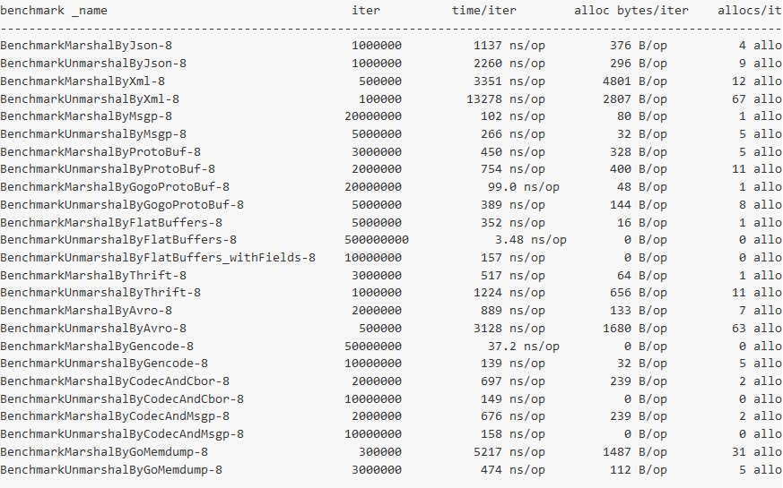

# 序列化框架

序列化是RPC服务框架实现中重要的一环，因为RPC是远程调用，需要数据序列化后传输，接收后再反序列对象。

序列化库也有不同的性能,有些序列化框架会尽量压缩数据和数据类型，有些包含元数据信息，它们的性能表现不尽相同。

对于Go生态圈的序列化框架，有一些开源项目对它们的性能做了对比，比如 [gosercomp](https://github.com/smallnest/gosercomp)做的性能比较：



可以看到XML、JSON相对于其它序列化方式性能挺差的，它们的好处在于通用性。比如rpcx实现了JSON-RPC和JSON-RPC2协议，可以和其它编程语言实现通讯。

关于Java的序列化框架的比较可以参考[jvm-serializers](https://github.com/eishay/jvm-serializers/):

目前最快的是[colfer](https://github.com/pascaldekloe/colfer)，比protobuf、protostuff还快。


rpcx的Server和Client类型都包含一个字段用来设置序列化器：
```go
type Client struct {
 ……
 ClientCodecFunc ClientCodecFunc
 ……
}

type Server struct {
 ServerCodecFunc ServerCodecFunc
 ……
}
```

这两个字段的类型定义如下:
```go
type ClientCodecFunc func(conn io.ReadWriteCloser) rpc.ClientCodec
type ServerCodecFunc func(conn io.ReadWriteCloser) rpc.ServerCodec
```

它们返回官方库的ClientCodec和ServerCodec。

当前rpcx提供了以下的序列化器:gob、bson、gencode、json-rpc、json-rpc2、protobuf,如果没有进行序列化
```go
func NewBsonClientCodec(conn io.ReadWriteCloser) rpc.ClientCodec

func NewBsonServerCodec(conn io.ReadWriteCloser) rpc.ServerCodec

func NewGencodeClientCodec(conn io.ReadWriteCloser) rpc.ClientCodec

func NewGencodeServerCodec(conn io.ReadWriteCloser) rpc.ServerCodec

func NewGobClientCodec(conn io.ReadWriteCloser) rpc.ClientCodec

func NewGobServerCodec(conn io.ReadWriteCloser) rpc.ServerCodec

func NewJSONRPC2ClientCodec(conn io.ReadWriteCloser) rpc.ClientCodec

func NewJSONRPC2ServerCodec(conn io.ReadWriteCloser) rpc.ServerCodec

func NewJSONRPCClientCodec(conn io.ReadWriteCloser) rpc.ClientCodec

func NewJSONRPCServerCodec(conn io.ReadWriteCloser) rpc.ServerCodec

func NewProtobufClientCodec(conn io.ReadWriteCloser) rpc.ClientCodec

func NewProtobufServerCodec(conn io.ReadWriteCloser) rpc.ServerCodec
```

