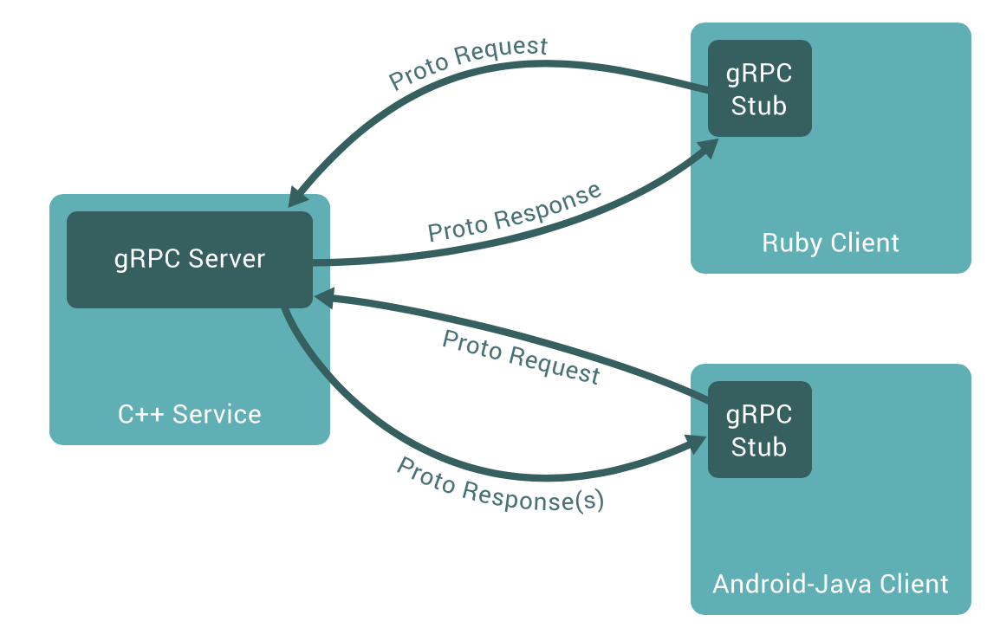

# gRPC库介绍

[gRPC](http://www.grpc.io/)是一个高性能、通用的开源RPC框架，其由Google主要面向移动应用开发并基于HTTP/2协议标准而设计，基于[ProtoBuf](http://en.wikipedia.org/wiki/Protocol_Buffers)(Protocol Buffers)序列化协议开发，且支持众多开发语言。
gRPC提供了一种简单的方法来精确地定义服务和为iOS、Android和后台支持服务自动生成可靠性很强的客户端功能库。
客户端充分利用高级流和链接功能，从而有助于节省带宽、降低的TCP链接次数、节省CPU使用、和电池寿命。

gRPC具有以下重要特征：
1. 强大的IDL特性
RPC使用ProtoBuf来定义服务，ProtoBuf是由Google开发的一种数据序列化协议，性能出众，得到了广泛的应用。
2. 支持多种语言
支持C++、Java、Go、Python、Ruby、C#、Node.js、Android Java、Objective-C、PHP等编程语言。
3. 基于HTTP/2标准设计



gRPC已经应用在Google的云服务和对外提供的API中。

我们以 gRPC-go 为例介绍一下gRPC的开发。

首先下载相应的库:
```go 
go get google.golang.org/grpc
go get -u github.com/golang/protobuf/{proto,protoc-gen-go}
```

同时保证按照Protocol Buffers v3 编译器到你的开发环境中(protoc)。

定义你的protobuf文件 (helloworld.proto):
```proto 
syntax = "proto3";

option java_package = "com.colobu.rpctest";

package greeter;

// The greeting service definition.
service Greeter {
  // Sends a greeting
  rpc SayHello (HelloRequest) returns (HelloReply) {}
}

// The request message containing the user's name.
message HelloRequest {
  string name = 1;
}

// The response message containing the greetings
message HelloReply {
  string message = 1;
}
```

这个文件定义了一个`Greeter`服务，它有一个`SayHello`方法，这个方法接收一个Request，返回一个Response。

然后我们可以编译这个文件，生成服务器和客户端的stub:
```sh 
protoc -I protos protos/helloworld.proto --go_out=plugins=grpc:src/greeter
```

因为上面我们安装了`proto`和`protoc-gen-go`，所以`protoc`可以生成响应的Go代码。

然后我们就可以利用这个生成的代码创建服务器代码和客户端代码了。

服务器端的代码如下：
```go
package main

import (
	"log"
	"net"

	pb "greeter"
	"golang.org/x/net/context"
	"google.golang.org/grpc"
)

const (
	port = ":50051"
)

type server struct{}

// SayHello implements helloworld.GreeterServer
func (s *server) SayHello(ctx context.Context, in *pb.HelloRequest) (*pb.HelloReply, error) {
	return &pb.HelloReply{Message: "Hello " + in.Name}, nil
}

func main() {
	lis, err := net.Listen("tcp", port)
	if err != nil {
		log.Fatalf("failed to listen: %v", err)
	}
	s := grpc.NewServer()
	pb.RegisterGreeterServer(s, &server{})
	s.Serve(lis)
}
```

客户端的测试代码如下：
```go 
package main

import (
	"fmt"
	"log"
	"os"
	"strconv"
	"sync"
	"time"
	
	pb "greeter"
	
	"golang.org/x/net/context"
	"google.golang.org/grpc"
)

const (
	address     = "localhost:50051"
	defaultName = "world"
)

func invoke(c pb.GreeterClient, name string) {
	r, err := c.SayHello(context.Background(), &pb.HelloRequest{Name: name})
	if err != nil {
		log.Fatalf("could not greet: %v", err)
	}
	_ = r
}

func syncTest(c pb.GreeterClient, name string) {
	i := 10000
	t := time.Now().UnixNano()	
	for ; i>0; i-- {
		invoke(c, name)
	}
	fmt.Println("took", (time.Now().UnixNano() - t) / 1000000, "ms")
}


func asyncTest(c [20]pb.GreeterClient, name string) {
	var wg sync.WaitGroup
    wg.Add(10000)
	
	i := 10000
	t := time.Now().UnixNano()	
	for ; i>0; i-- {
		go func() {invoke(c[i % 20], name);wg.Done()}()
	}	
	wg.Wait()
	fmt.Println("took", (time.Now().UnixNano() - t) / 1000000, "ms")
}


func main() {
	// Set up a connection to the server.
	conn, err := grpc.Dial(address)
	if err != nil {
		log.Fatalf("did not connect: %v", err)
	}
	defer conn.Close()
	var c [20]pb.GreeterClient
	 

	// Contact the server and print out its response.
	name := defaultName
	sync := true
	if len(os.Args) > 1 {
		sync, err = strconv.ParseBool(os.Args[1])
	}
	
	//warm up
	i := 0
	for ; i < 20; i++ {
		c[i] = pb.NewGreeterClient(conn)
		invoke(c[i], name)
	}
	
	if sync {
		syncTest(c[0], name)
	} else {
		asyncTest(c, name)
	}
}
```


## 参考文档
1. http://www.grpc.io/docs/quickstart/go.html
2. http://www.infoq.com/cn/news/2015/03/grpc-google-http2-protobuf
3. https://github.com/smallnest/RPC-TEST