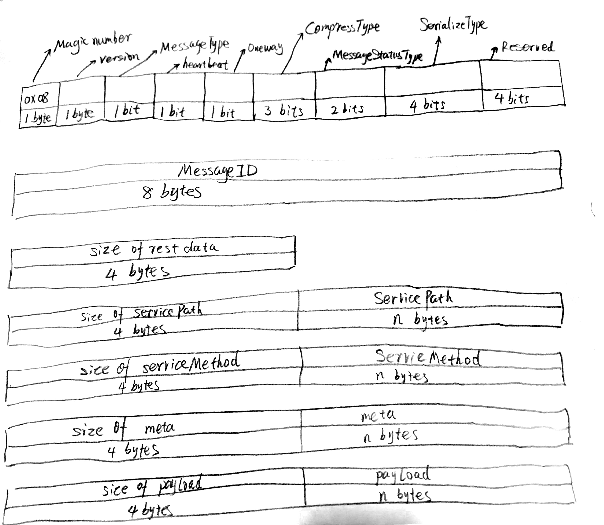

# 协议

rpcx 的 请求(request)和响应(response)使用相同的数据结构。

一个消息由下面的项组成:

1. Header: 4 字节
2. Message ID: 8 字节
3. total size: 4 字节, 不包含header和它本身, uint32类型
4. servicePath值的长度: 4 字节, uint32类型
5. servicePath的值: UTF-8 字符串
6. serviceMethod值的长度: 4 字节, uint32类型
7. serviceMethod的值: UTF-8 字符串
8. metadata的大小: 4 字节, uint32类型
9. metadata: 格式: `size` `key1 string` `size` `value1 string`, 可以包含多个
10. playload的大小: 4 字节, uint32类型
11. playload的值: slice of byte

`#4` + `#6` + `#8` + `#10 + (4 + 4 + 4 + 4)` 的字节数加起来等于 `#3`的值。

`servicePath`、`serviceMethod`、`和 `meta`中的key` 、 `value` 都是UTF-8 字符串。

rpcx 使用 `size of an element` + `element` 的格式定义可变长的元素， 就像 [TLV](https://en.wikipedia.org/wiki/Type-length-value )， 但是 rpcx 不需要 `Type`字段， 这是因为 元素的`Type` 要么是 UTF-8 字符串，要么就是明确的slice。

对整数使用大端 `BigEndian` 编码 \(integer type, int64, uint32 等等\)

1、T第一个字节是 `0x08`, 它是一个魔数 (magic number)

2、第二个字节是 `version`. 当前的版本是 0.

3、MessageType 可以是:  
  - 0: Request  
  - 1: Response

4、Heartbeat: bool. 指示这个消息是否是heartbeat消息

5、Oneway: bool. true的话意味着服务不需要返回response

6、CompressType:  压缩类型
  - 0: don't compress  
  - 1: Gzip

7、MessageStatusType: 指示 response 是一个错误还是正常的返回值
  - 0: Normal  
  - 1: Error

8、SerializeType: 编解码格式  
  - 0: 使用原始的byte slice 
  - 1: JSON  
  - 2: Protobuf  
  - 3: MessagePack

如果服务处理请求失败，它会返回error response， 它会设置 response 的 MessageStatusType为 `1`, 并且在meta中设置错误信息， meta中的 key值是 **rpcx\_error**， 值是错误信息。

